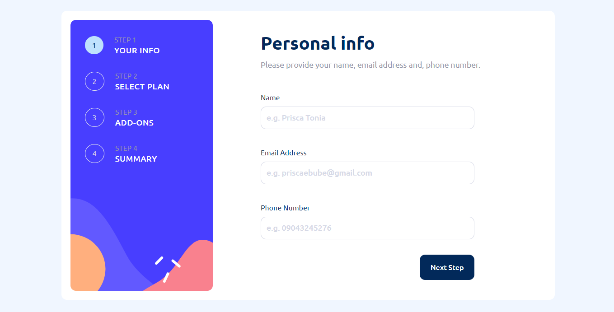
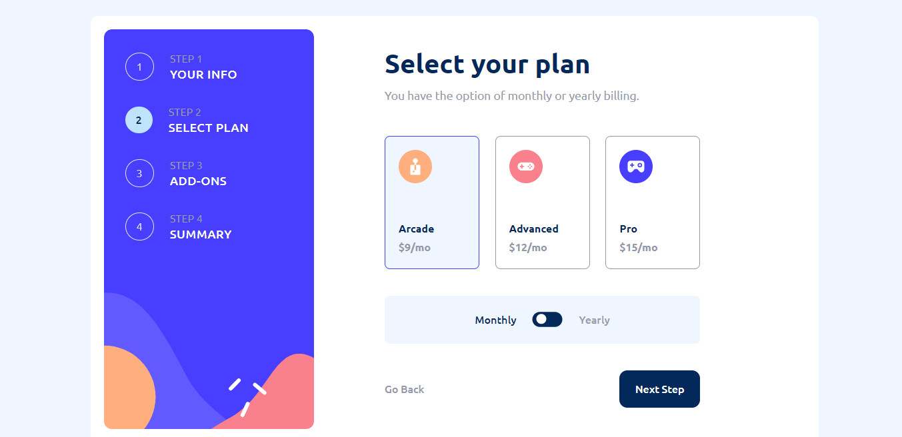
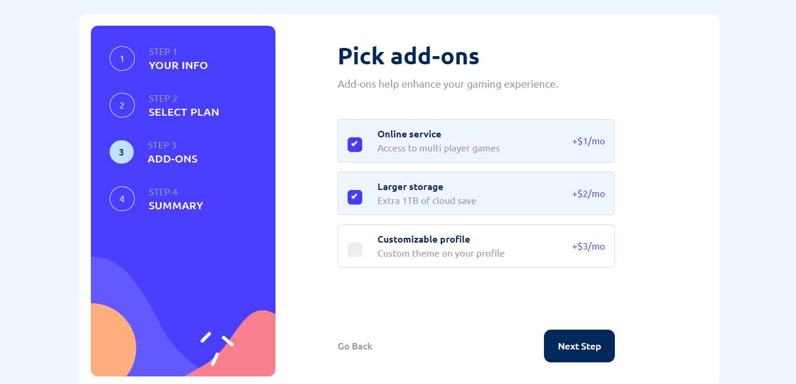
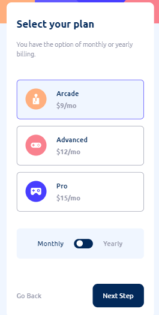
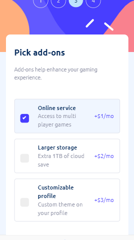

# Frontend Mentor - Multi-step form solution

This is a solution to the [Multi-step form challenge on Frontend Mentor](https://www.frontendmentor.io/challenges/multistep-form-YVAnSdqQBJ). Frontend Mentor challenges help you improve your coding skills by building realistic projects. 

## Table of contents

- [Frontend Mentor - Multi-step form solution](#frontend-mentor---multi-step-form-solution)
  - [Table of contents](#table-of-contents)
  - [Overview](#overview)
    - [The challenge](#the-challenge)
    - [Screenshot](#screenshot)
    - [Links](#links)
  - [My process](#my-process)
    - [Built with](#built-with)
    - [What I learned](#what-i-learned)
  - [Author](#author)
  - [Acknowledgments](#acknowledgments)

## Overview

### The challenge

Users should be able to:

- Complete each step of the sequence
- Go back to a previous step to update their selections
- See a summary of their selections on the final step and confirm their order
- View the optimal layout for the interface depending on their device's screen size
- See hover and focus states for all interactive elements on the page
- Receive form validation messages if:
  - A field has been missed
  - The email address is not formatted correctly
  - A step is submitted, but no selection has been made

### Screenshot

### Links

- Solution URL: [GitHub URL](https://github.com/PriscaTonia/Multi-Step-Form)
- Live Site URL: [Live Site URL](https://multi-step-form-ntb.vercel.app/)

## My process

### Built with

- JavaScript
- Framer Motion
- Vite
- Tailwind
- React-Hook-Form
- [React](https://reactjs.org/) - JS library

### What I learned

I was able to extensively practice React useContext Hook, React Hook Form and Framer Motion during the development of this project. I also made use of localStorage to be able to store the values while still in a particular session of usage. I'm quite proud of myself and this project. I learnt a lot and hope to continue learning and be the best!

## Author

- Website - [Prisca Onwudebelu Ebubechukwu](https://prisca.vercel.app)
- Frontend Mentor - [@PriscaTonia](https://www.frontendmentor.io/profile/PriscaTonia)
- Twitter - [@EbubePrisca](https://twitter.com/EbubePrisca)

## Acknowledgments

I acknowledge God almighty, for the strength to carry on this project till the end, I'm grateful to Yibaebi Elliot for his guidiance, and mentorship during the development of this project.

I'm grateful to myself for not giving up. Well done Girlie!
